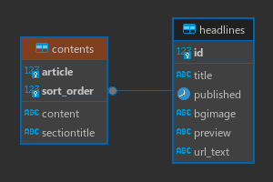
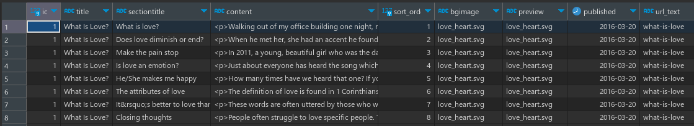
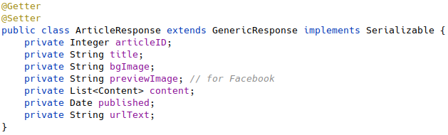
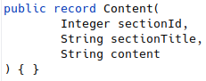
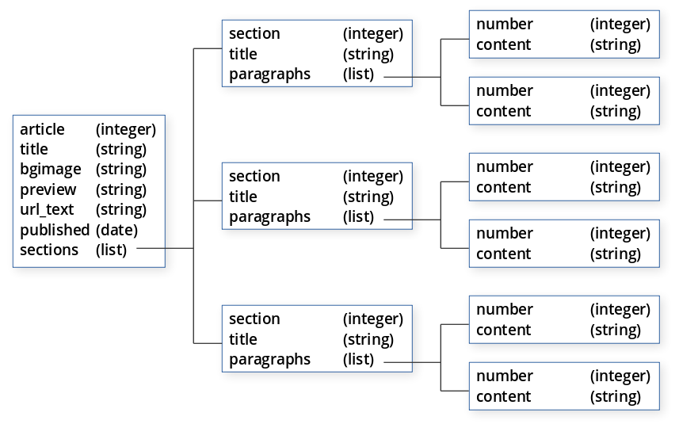
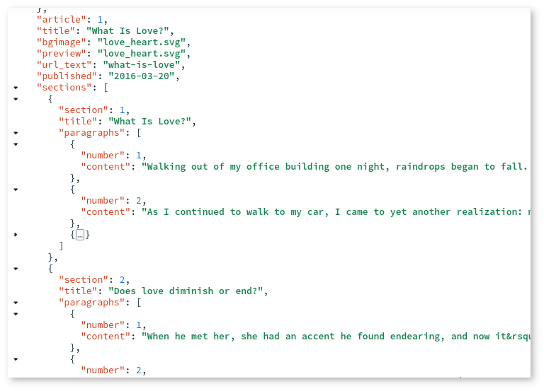

# Articles

### Purpose

I developed this system to contain articles I wanted to write but did not want hosted on third-party systems. I also did not want to attempt to publish on existing blog sites where I would have no input over what is written by others, which may present theologically unsound ideas that would cause readers to steer away from the site entirely. Having full control over the blog site would also mean I take full responsibility and am completely accountable for what is published.

## The tech stack

This is a seemingly simple Spring Boot (Java) web application. The original version was Spring Boot 2 + Thymeleaf + PostGreSQL running on bare metal. Over time, I packaged it as a Docker image, and it now gets deployed onto Kubernetes.

I recently decided that PostGreSQL did not make sense for this project and that a NoSQL database was more appropriate, a decision purely driven by the data model. Consider what the data model was for a normalized, relational database:



In my service layer, I would create a hierarchical object from this tabular data:



That data would then be iterated over to create the following nested classes:




Thinking about the "content" attribute of the Content class, it was a multi-paragraph string with embedded HTML to separate paragraphs (`<p>` and `</p>` tags).

A better approach would be to have sections with a list or array of paragraphs, which would give us the well-known tree structure:



Using MongoDB (the NoSQL database I settled on), each article has the exact structure of its corresponding MongoDB document. The data in MongoDB is structured as follows:



This allows Spring Data to directly map the data to nested objects with zero logic that iterates over the query results. The Thymeleaf front end directly uses the data to render the article.


```json
{
  sections: {
    $map: {
      input: {
        $sortArray: {
          input: "$sections",
          sortBy: {
            section: 1
          }
        }
      },
      as: "sec",
      in: {
        $mergeObjects: [
          "$$sec",
          {
            paragraphs: {
              $sortArray: {
                input: "$$sec.paragraphs",
                sortBy: {
                  number: 1
                }
              }
            }
          }
        ]
      }
    }
  }
}
```
